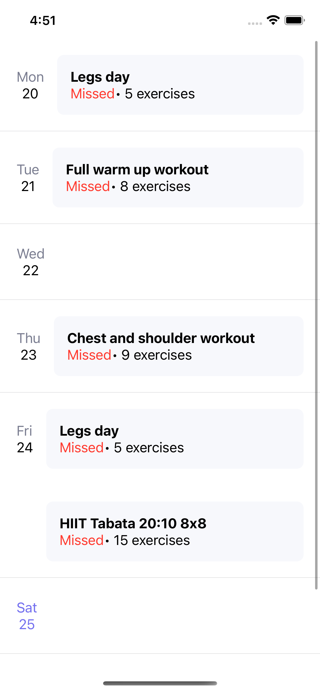
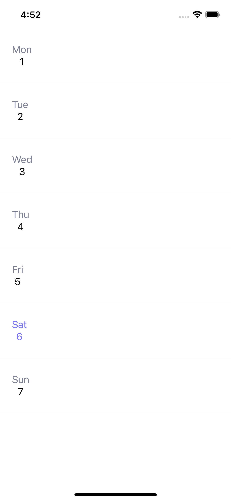

# WorkoutCalendar

## Coding Test

Build out a calendar to manage working training. Should be able to 
1) View the title and status of week’s workouts, 
2) Mark them as completed (locally). 


```
Product Requirements
TRAINING CALENDAR SCREEN
1. Should show 1 week of day containers, Monday to Sunday
     a. The days of the week should show up on top left of each cell
     b. The days of the month for this current week should show up just below the day of the week
     c. The date for Today should be colored purple (example shown on Fri)  

2. Each day container can hold a number of workouts

3. Each workout container will have:
     a. A workout name, that ends in “...” if the name is too long 
     b. Total number of exercises belong to that workout
     c. Status if the workout is in the past (Missed, Completed), today (Assigned, Completed), or in the future (greyed out)
     d. Color should be different for different states (According to design)
4. When u tap on a non empty cell, it should mark / unmark that cell locally (based on the item ID). If the cell marked, there will be a checkmark appear on the right side of the cell.

5. When the API request is loading, all cells should still have the dates, but empty data.
```

>Tech Requirements (Bonus point: Unit test)
>>1. Use the best architecture that you confident (as clean as possible)
>>2. API Call requires
>>3. The data must be cached and loaded next time the app open


## Output Test

### Image

| training  | training empty |
| ------------- |-------------|
|  |  |


### Video

<video src="https://github.com/hai-dct/WorkoutCalendar/assets/24885572/88110234-f29e-4183-ae2d-43bceacf14e2" width=320>